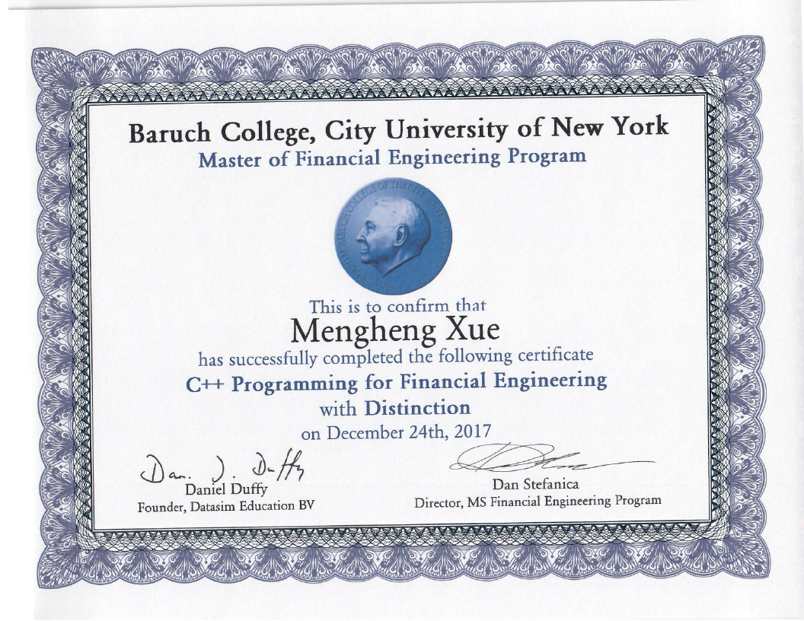

# Option-Pricing-Model
QunatNet C++ in Finanace Cerfitcate Final Project

## Summary
* [Exact (closed) solutions](#exact-solutions)
* [Monte Carlo (MC) method](#mc-method)
* [Finite Difference method (FDM)](#FDM)
